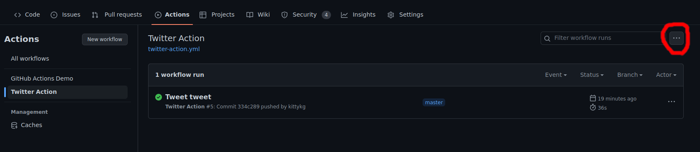

# SPIKE Research Group Website

The following sections explain how to change some things that are not directly available in Netlify's CMS.

## Testing the website in your computer

## Adding a publication
The `publications` folder contains a BibTeX file called `ref.bib` in which all the publications are stored. Therefore, any publication you may add must be formatted in BibTeX. If you don't have a BibTeX prepared for your publications, you can:
* Use the ones in the file as a reference; or 
* Try to find your publication in [DBLP](https://dblp.org/) and get the BibTeX from there. These BibTeX usually contain a lot of data that you may wish to remove (e.g. editors, doi, timestamp, biburl, bibsource).
* Please include the **url** to your publication. The url field is essential for
our twitter bot to tweet your work.

Once you have your BibTeX available, you can also add the following custom entries:
* `_code` - a link to the repository containing the implementation of your paper (or a binary).
* `_type` - this is added in case you want to specify a custom type which cannot be specified through BibTeX's usual tags (`unpublished`, `inproceedings`, `article`, ...). The currently supported custom types are (if you need any other type of custom type, let us know!):
    * `workshop` - if your paper has been published in a workshop.
We can add more custom entries if you want (e.g., if you want to add a link to a set of slides, a poster, ...).
* `_tags` - this is used to sort the papers on our website and used as twitter
tag on our tweets (the official Twitter account for Spike:
[Twitter](https://twitter.com/SPIKE_ICL)). We strongly recommend you to include
**one or more tags** in this field.

If for some reason your publication does not appear once added, let us know (there might be a problem with the filtering).

### IMPORTANT NOTE on modifying `ref.bib`

Our twitter bot is relied on GitHub action. The action only handles single 
addition of entry.

* If you are adding entries, please **ADD ONE PER COMMIT** so that the twitter
bot can tweet bothworks. Please **DO NOT** modify other entries. Before you commit and push your code, check if the [Twitter Action workflow](https://github.com/spike-imperial/site/actions/workflows/twitter-action.yml) is enabled.
If not enabled, your entry won't trigger a tweet, and you need to enable the workflow so that your entry would be tweeted.

* If you are changing entries (e.g. adding `_tags` to entries), please only
**MODIFY** and **DO NOT** add entry. Before you commit and push your code,
please **disable** the Twitter action. Once you have pushed your code, enable the Twitter action workflow again.

To disable the twitter action:

* Go to Actions -> [Twitter Action](https://github.com/spike-imperial/site/actions/workflows/twitter-action.yml)

* Click on the '**...**' icon next to the filter, and click '**Disable workflow**' from the drop down.

To enable the twitter action: go to the same page: Actions -> [Twitter Action](https://github.com/spike-imperial/site/actions/workflows/twitter-action.yml). There should be a big yellow box saying 'This workflow was disabled manually'. Click the '**Enable workflow**' button.

## Adding a person
To add a person you will need to edit the `_data/people.yaml`. There is a YAML list entry for each person whose (possible) fields are the following:
* `name` - A string indicating the person's name.
* `surname` - A string indicating the person's surname.
* `groups` - A list containing the groups of people to which the person belongs. The available groups are the following:
    * `pi` - Principal investigator.
    * `alumni` - Former PhD students of the group.
    * `post-doc` - Post-doctoral researcher.
    * `phd-student` - PhD student.
    * `internal-collaborator` - A collaborator who is also at Imperial College London.
    * `external-academic-collaborator` - A collaborator from another academic institution.
    * `external-industrial-collaborator` - A collaborator from industry.
* `institution` - Name of the current institution to which the person belongs.
* `social` - It contains the following fields, which will be shown below the person's name if specified (more fields can be potentially added, but we would only ask people to add the most relevant ones):
    * `scholar` - Link to Google Scholar's profile page.
    * `github` - Link to the person's personal GitHub page.
    * `website` - Link to the person's personal website.
    * `researchgate` - Link to the ResearchGate profile page.
* `alumni` - A field which should only be given for alumni of the group. It contains the following subfields:
    * `role` - Role of the student (most of them will be "PhD Student").
    * `start` - Starting year.
    * `end` - Ending year (if unspecified, only the starting year will be shown).
* `photo` - The name of the image file in the `assets/images/teampic` directory.

In case you add a personal photograph to the above directory, please try to make it relatively light (< 100 KB). The CMS already compresses it a bit, but we would be grateful if you do it in advance in case the CMS fails to do so.

